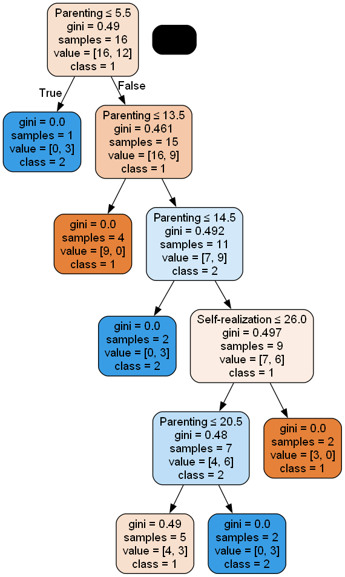

# SuperMom

## Intro

"SuperMom" is a psychological family reality show in which every week four moms compete for the title of the best.
From Monday to Thursday they visit each other and judge everything: cleanliness in the house, parenting and 
self-actualization of the other mom.

They are closely followed by the guru of family psychology Dmitry Karpachev, who throughout the week will comment 
on the behavior of moms, and on Friday will arrange a total debriefing and will make his assessments. 
The moms will also evaluate each other, and the one who managed to impress the competitors and the psychologist 
will receive the title "SuperMom".

Project Plan:
1. Based on the photo scores of the participants of the 1st season of the project, create a table containing the 
following information:
   * id of the participant,
   * the sum of her scores for housekeeping,
   * the sum of her scores for parenting,
   * the sum of her scores for self-actualization,
   * the sum of her scores in all categories,
   * season,
   * series,
   * type of mom,
   * city.
   
    The last four values will be taken from the name of the photo with grades.
2. On this data set, construct a simple classification model of mom type, depending on the other variables.
There is no goal to find a perfect clustering algorithm, just to show the implementation of the basic models.

## Dataset creation

Having received photos of the project participants' ratings for season 1 (example above) with file names like: \
"{id}ses{season}_s{series}_t{type}_c{city}.png", \
we can get down to business. First, we use Google Cloud Vision API (at first I tried to use Tesseract OCR for 
this purpose, but the recognition accuracy was very low) to recognize the grades from the photo, 
and then we turn the data from the file names combined with the grades into a table of the following form:

| ID | Thrift | Parenting | Self-realization | Total points | Season | Episode | Type | City |
|----|--------|-----------|------------------|--------------|--------|---------|------|------|
| 1  | 12     | 15        | 24               | 51           | 1      | 1       | 2    | 1    |
| 2  | 18     | 5         | 15               | 110          | 1      | 1       | 2    | 1    |

### Decoding for mom types and cities:

**Types of moms**: \
1-Career \
2-Housewife

**Cities**: \
1-Kyiv \
2-Charkiv \
3-Odessa

## Classification Models

On the previously created dataset, let's find a method to classify the type of mom, using the following types of classifiers: 
Decision Tree, Random Forest, SVM and Neural Network. 

Initially, 'Thrift', 'Parenting', 'Self-realization', and 'City' were intuitively chosen as the variables by which our 
dependent variable, type of mom, would be classified, but after measuring the contribution of each variable to the 
classification, it turned out that only Parenting and Self-realization made a significant contribution. For this reason,
all the models listed above were built on these variables.

### Decision Tree

The accuracy of this model is about 50-55%, which is quite low. A possible reason for this low 
accuracy may be the very small number of data, because of which the model is not very accurate.
Despite the fact that this algorithm has not performed well, let us try to apply Random forest,
which is a commonly-used machine learning algorithm, 
which combines the output of multiple decision trees to reach a single result.

### Random Forest

It was build on the best hyperparameters: 'n_estimators': 100, 'max_depth': 5, and accuracy of this model is 58.33%.
Also, for this model I save importance of parameters, so you can put in 'X_cols' list all variables that you want 
and see which percent of classification is built on each variable.

### Support Vector Machines

This algorithm already has a fairly high accuracy of 75%. 

### Neural Network

In this case we have implementation of a neural network using Python with TensorFlow and Keras. 
And final accuracy of this model is 1, but it's possible that the model is overfitting. One of the best 
and easiest way to check it is just build model on more data. But unfortunately we do not have this option.

## Conclusion

The best accuracy was shown by Neural Network, but as written above this may be due to models overfitting. 
So, to me, the most applicable model in this case is SVM. 
